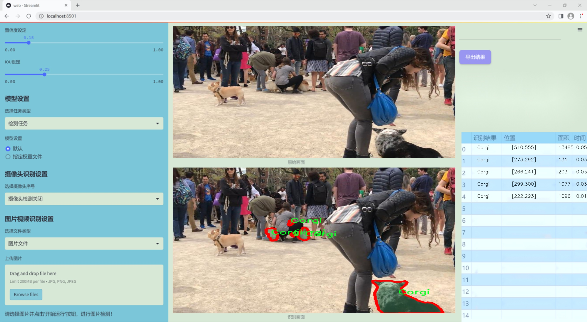
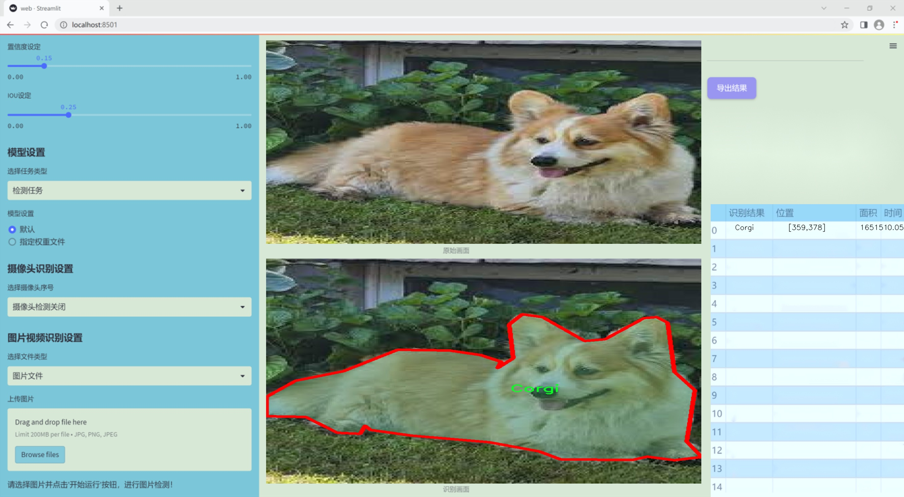
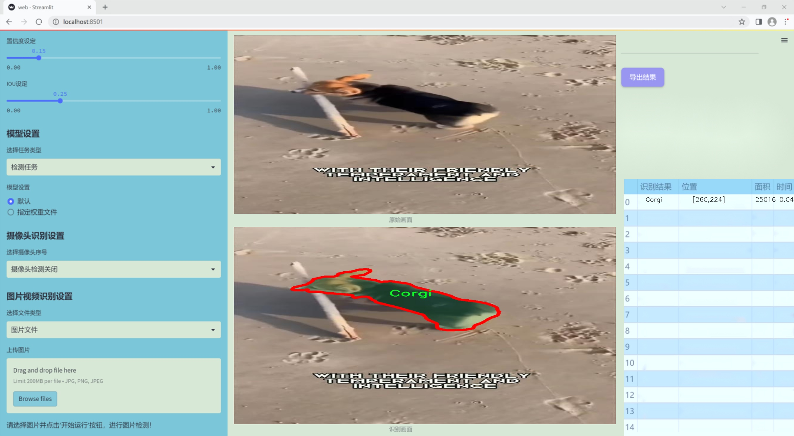
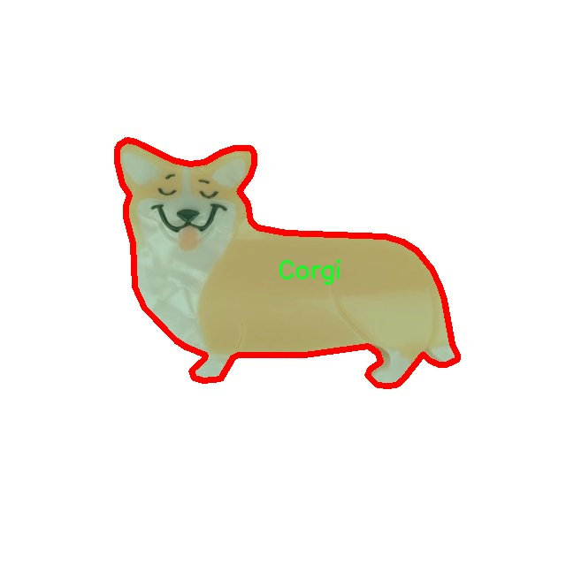
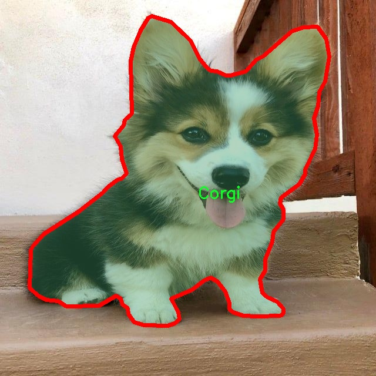
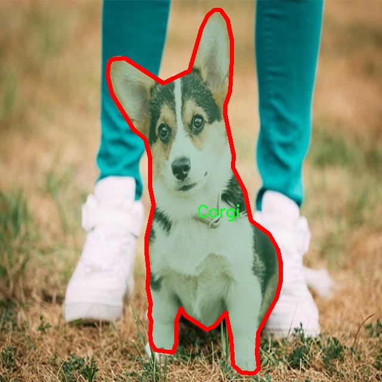
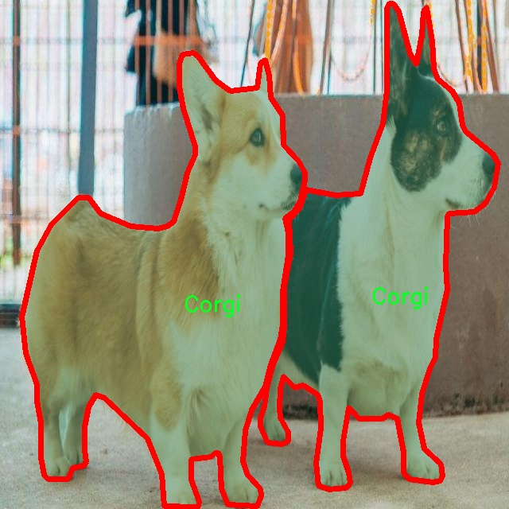

### 1.背景意义

研究背景与意义

随着计算机视觉技术的迅猛发展，实例分割作为其中一个重要的研究方向，已经在多个领域得到了广泛应用，包括自动驾驶、医疗影像分析和智能监控等。实例分割不仅需要识别图像中的物体，还要求精确地分割出每个物体的轮廓，这对于实现更高层次的智能理解至关重要。在众多实例分割算法中，YOLO（You Only Look Once）系列模型因其高效性和实时性而备受关注。YOLOv11作为该系列的最新版本，进一步提升了模型的精度和速度，为实例分割任务提供了更为强大的技术支持。

本研究旨在基于改进的YOLOv11模型，构建一个专门针对犬种——柯基犬（Corgi）的实例分割系统。柯基犬因其独特的外形和广泛的受欢迎程度，成为了计算机视觉研究中的一个有趣案例。我们使用的Corgi v2数据集包含1600张经过精确标注的柯基犬图像，数据集的单一类别特性使得模型训练过程更加专注，有助于提升模型在特定犬种实例分割任务中的表现。

通过对柯基犬的实例分割研究，不仅可以推动宠物识别技术的发展，还能为动物保护、宠物管理等相关领域提供数据支持和技术保障。此外，改进YOLOv11模型的应用也为实例分割技术的进一步优化提供了可能性。研究成果将为未来在其他犬种或动物实例分割任务中的应用奠定基础，推动计算机视觉技术在更广泛领域的应用与发展。

### 2.视频效果

[2.1 视频效果](https://www.bilibili.com/video/BV1a3qrYTERP/)

### 3.图片效果







##### [项目涉及的源码数据来源链接](https://kdocs.cn/l/cszuIiCKVNis)**

注意：本项目提供训练的数据集和训练教程,由于版本持续更新,暂不提供权重文件（best.pt）,请按照6.训练教程进行训练后实现上图演示的效果。

### 4.数据集信息

##### 4.1 本项目数据集类别数＆类别名

nc: 1
names: ['Corgi']


该项目为【图像分割】数据集，请在【训练教程和Web端加载模型教程（第三步）】这一步的时候按照【图像分割】部分的教程来训练

##### 4.2 本项目数据集信息介绍

本项目数据集信息介绍

本项目旨在改进YOLOv11的犬种实例分割系统，所使用的数据集以“Corgi v2”为主题，专注于对柯基犬这一特定犬种的实例分割任务。该数据集的设计初衷是为了提升模型在识别和分割柯基犬时的准确性和效率，进而推动计算机视觉领域在宠物识别方面的应用。数据集中包含了丰富的柯基犬图像，涵盖了不同的环境、姿态和光照条件，以确保模型能够在多样化的场景中进行有效的学习。

在数据集的构建过程中，我们注重图像的多样性和质量，确保每一张图像都能为模型提供有价值的信息。数据集的类别数量为1，具体类别为“Corgi”，这意味着所有的图像均围绕柯基犬展开。通过集中训练于单一类别，我们可以更深入地挖掘柯基犬的特征，从而提高模型的专注度和识别能力。每张图像都经过精心标注，确保柯基犬的轮廓和特征得到准确的标识，为后续的实例分割提供了坚实的基础。

此外，数据集还考虑到了柯基犬在不同背景下的表现，包括室内、室外、自然环境以及城市环境等。这种多样化的场景设置不仅增强了模型的泛化能力，也为实际应用提供了更广泛的适用性。通过使用该数据集进行训练，我们期望能显著提升YOLOv11在柯基犬实例分割任务中的表现，为未来的宠物识别技术发展奠定基础。总之，本项目的数据集不仅为模型训练提供了必要的素材，也为深入研究犬种识别和分割技术提供了宝贵的数据支持。










### 5.全套项目环境部署视频教程（零基础手把手教学）

[5.1 所需软件PyCharm和Anaconda安装教程（第一步）](https://www.bilibili.com/video/BV1BoC1YCEKi/?spm_id_from=333.999.0.0&vd_source=bc9aec86d164b67a7004b996143742dc)


[5.2 安装Python虚拟环境创建和依赖库安装视频教程（第二步）](https://www.bilibili.com/video/BV1ZoC1YCEBw?spm_id_from=333.788.videopod.sections&vd_source=bc9aec86d164b67a7004b996143742dc)

### 6.改进YOLOv11训练教程和Web_UI前端加载模型教程（零基础手把手教学）

[6.1 改进YOLOv11训练教程和Web_UI前端加载模型教程（第三步）](https://www.bilibili.com/video/BV1BoC1YCEhR?spm_id_from=333.788.videopod.sections&vd_source=bc9aec86d164b67a7004b996143742dc)


按照上面的训练视频教程链接加载项目提供的数据集，运行train.py即可开始训练



     Epoch   gpu_mem       box       obj       cls    labels  img_size
     1/200     20.8G   0.01576   0.01955  0.007536        22      1280: 100%|██████████| 849/849 [14:42<00:00,  1.04s/it]
               Class     Images     Labels          P          R     mAP@.5 mAP@.5:.95: 100%|██████████| 213/213 [01:14<00:00,  2.87it/s]
                 all       3395      17314      0.994      0.957      0.0957      0.0843

     Epoch   gpu_mem       box       obj       cls    labels  img_size
     2/200     20.8G   0.01578   0.01923  0.007006        22      1280: 100%|██████████| 849/849 [14:44<00:00,  1.04s/it]
               Class     Images     Labels          P          R     mAP@.5 mAP@.5:.95: 100%|██████████| 213/213 [01:12<00:00,  2.95it/s]
                 all       3395      17314      0.996      0.956      0.0957      0.0845

     Epoch   gpu_mem       box       obj       cls    labels  img_size
     3/200     20.8G   0.01561    0.0191  0.006895        27      1280: 100%|██████████| 849/849 [10:56<00:00,  1.29it/s]
               Class     Images     Labels          P          R     mAP@.5 mAP@.5:.95: 100%|███████   | 187/213 [00:52<00:00,  4.04it/s]
                 all       3395      17314      0.996      0.957      0.0957      0.0845


###### [项目数据集下载链接](https://kdocs.cn/l/cszuIiCKVNis)

### 7.原始YOLOv11算法讲解

YOLOv11是一种由Ultralytics公司开发的最新一代目标检测模型，以其增强的特征提取能力和更高的效率在计算机视觉领域引人注目。该模型在架构上进行了关键升级，通过更新主干和颈部结构，显著提高了对复杂视觉场景的理解和处理精度。YOLOv11不仅在目标检测上表现出色，还支持实例分割、图像分类、姿态估计和定向目标检测（OBB）等任务，展示出其多功能性。

与其前身YOLOv8相比，YOLOv11在设计上实现了深度和宽度的改变，同时引入了几个创新机制。其中，C3k2机制是对YOLOv8中的C2f的改进，提升了浅层特征的处理能力；C2PSA机制则进一步优化了特征图的处理流程。解耦头的创新设计，通过增加两个深度卷积（DWConv），提高了模型对细节的感知能力和分类准确性。

在性能上，YOLOv11m模型在COCO数据集上的平均精度（mAP）提高，并减少了22%的参数量，确保了在运算效率上的突破。该模型可以部署在多种平台上，包括边缘设备、云平台以及支持NVIDIA GPU的系统，彰显出卓越的灵活性和适应性。总体而言，YOLOv11通过一系列的创新突破，对目标检测领域产生了深远的影响，并为未来的开发提供了新的研究方向。


****文档**** ： _ _https://docs.ultralytics.com/models/yolo11/__

****代码链接**** ： _ _https://github.com/ultralytics/ultralytics__

******Performance Metrics******


​ ** **关键特性****

****◆**** ** **增强的特征提取能力**** ：YOLO11采用了改进的主干和颈部架构，增强了 ** **特征提取****
能力，能够实现更精确的目标检测和复杂任务的执行。

****◆**** ** **优化的效率和速度****
：YOLO11引入了精细化的架构设计和优化的训练流程，提供更快的处理速度，并在准确性和性能之间保持最佳平衡。

****◆**** ** **参数更少、精度更高****
：通过模型设计的改进，YOLO11m在COCO数据集上实现了更高的平均精度（mAP），同时使用的参数比YOLOv8m少22%，使其在计算上更加高效，而不牺牲准确性。

****◆**** ** **跨环境的适应性**** ：YOLO11可以无缝部署在各种环境中，包括边缘设备、云平台和支持NVIDIA
GPU的系统，确保最大的灵活性。

****◆**** ** **支持广泛任务****
：无论是目标检测、实例分割、图像分类、姿态估计还是定向目标检测（OBB），YOLO11都旨在应对一系列计算机视觉挑战。

****支持的任务和模式****


​YOLO11建立在YOLOv8中引入的多功能模型范围之上，为各种计算机视觉任务提供增强的支持:


​该表提供了YOLO11模型变体的概述，展示了它们在特定任务中的适用性以及与Inference、Validation、Training和Export等操作模式的兼容性。从实时检测到复杂的分割任务
，这种灵活性使YOLO11适用于计算机视觉的广泛应用。

##### yolov11的创新

■ yolov8 VS yolov11

YOLOv5，YOLOv8和YOLOv11均是ultralytics公司的作品，ultralytics出品必属精品。


​ **具体创新点** ：

**① 深度（depth）和宽度 （width）**

YOLOv8和YOLOv11是基本上完全不同。

**② C3k2机制**

C3k2有参数为c3k，其中在网络的浅层c3k设置为False。C3k2就相当于YOLOv8中的C2f。


​ **③ C2PSA机制**

下图为C2PSA机制的原理图。


​ **④ 解耦头**

解耦头中的分类检测头增加了两个 **DWConv** 。


▲Conv

    
    
    def autopad(k, p=None, d=1):  # kernel, padding, dilation
    
        """Pad to 'same' shape outputs."""
    
        if d > 1:
    
            k = d * (k - 1) + 1 if isinstance(k, int) else [d * (x - 1) + 1 for x in k]  # actual kernel-size
    
        if p is None:
    
            p = k // 2 if isinstance(k, int) else [x // 2 for x in k]  # auto-pad
    
    return p
    
    
    class Conv(nn.Module):
    
        """Standard convolution with args(ch_in, ch_out, kernel, stride, padding, groups, dilation, activation)."""
    
    
        default_act = nn.SiLU()  # default activation
    
    
        def __init__(self, c1, c2, k=1, s=1, p=None, g=1, d=1, act=True):
    
            """Initialize Conv layer with given arguments including activation."""
    
            super().__init__()
    
            self.conv = nn.Conv2d(c1, c2, k, s, autopad(k, p, d), groups=g, dilation=d, bias=False)
    
            self.bn = nn.BatchNorm2d(c2)
    
            self.act = self.default_act if act is True else act if isinstance(act, nn.Module) else nn.Identity()
    
    
        def forward(self, x):
    
            """Apply convolution, batch normalization and activation to input tensor."""
    
            return self.act(self.bn(self.conv(x)))
    
    
        def forward_fuse(self, x):
    
            """Perform transposed convolution of 2D data."""
    
            return self.act(self.conv(x))

▲Conv2d

    
    
    torch.nn.Conv2d(in_channels, out_channels, kernel_size, stride=1, padding=0, dilation=1, groups=1, bias=True, padding_mode='zeros')

▲DWConv

DWConv ** **代表 Depthwise Convolution（深度卷积）****
，是一种在卷积神经网络中常用的高效卷积操作。它主要用于减少计算复杂度和参数量。

    
    
    class DWConv(Conv):
    
        """Depth-wise convolution."""
    
    
        def __init__(self, c1, c2, k=1, s=1, d=1, act=True):  # ch_in, ch_out, kernel, stride, dilation, activation
    
            """Initialize Depth-wise convolution with given parameters."""
    
            super().__init__(c1, c2, k, s, g=math.gcd(c1, c2), d=d, act=act)


### 8.200+种全套改进YOLOV11创新点原理讲解

#### 8.1 200+种全套改进YOLOV11创新点原理讲解大全

由于篇幅限制，每个创新点的具体原理讲解就不全部展开，具体见下列网址中的改进模块对应项目的技术原理博客网址【Blog】（创新点均为模块化搭建，原理适配YOLOv5~YOLOv11等各种版本）

[改进模块技术原理博客【Blog】网址链接](https://gitee.com/qunmasj/good)


#### 8.2 精选部分改进YOLOV11创新点原理讲解

###### 这里节选部分改进创新点展开原理讲解(完整的改进原理见上图和[改进模块技术原理博客链接](https://gitee.com/qunmasj/good)【如果此小节的图加载失败可以通过CSDN或者Github搜索该博客的标题访问原始博客，原始博客图片显示正常】



### 视觉transformer(ViT)简介
视觉transformer(ViT)最近在各种计算机视觉任务中证明了巨大的成功，并受到了相当多的关注。与卷积神经网络(CNNs)相比，ViT具有更强的全局信息捕获能力和远程交互能力，表现出优于CNNs的准确性，特别是在扩大训练数据大小和模型大小时[An image is worth 16x16 words: Transformers for image recognition at scale,Coatnet]。

尽管ViT在低分辨率和高计算领域取得了巨大成功，但在高分辨率和低计算场景下，ViT仍不如cnn。例如，下图(左)比较了COCO数据集上当前基于cnn和基于vit的一级检测器。基于vit的检测器(160G mac)和基于cnn的检测器(6G mac)之间的效率差距超过一个数量级。这阻碍了在边缘设备的实时高分辨率视觉应用程序上部署ViT。


左图:现有的基于vit的一级检测器在实时目标检测方面仍然不如当前基于cnn的一级检测器，需要的计算量多出一个数量级。本文引入了第一个基于vit的实时对象检测器来弥补这一差距。在COCO上，efficientvit的AP比efficientdet高3.8，而mac较低。与YoloX相比，efficient ViT节省67.2%的计算成本，同时提供更高的AP。

中:随着输入分辨率的增加，计算成本呈二次增长，无法有效处理高分辨率的视觉应用。

右图:高分辨率对图像分割很重要。当输入分辨率从1024x2048降低到512x1024时，MobileNetV2的mIoU减少12% (8.5 mIoU)。在不提高分辨率的情况下，只提高模型尺寸是无法缩小性能差距的。

ViT的根本计算瓶颈是softmax注意模块，其计算成本随输入分辨率的增加呈二次增长。例如，如上图(中)所示，随着输入分辨率的增加，vit- small[Pytorch image models. https://github.com/rwightman/ pytorch-image-models]的计算成本迅速显著大于ResNet-152的计算成本。

解决这个问题的一个直接方法是降低输入分辨率。然而，高分辨率的视觉识别在许多现实世界的计算机视觉应用中是必不可少的，如自动驾驶，医疗图像处理等。当输入分辨率降低时，图像中的小物体和精细细节会消失，导致目标检测和语义分割性能显著下降。

上图(右)显示了在cityscape数据集上不同输入分辨率和宽度乘法器下MobileNetV2的性能。例如，将输入分辨率从1024x2048降低到512x1024会使cityscape的性能降低12% (8.5 mIoU)。即使是3.6倍高的mac，只放大模型尺寸而不增加分辨率也无法弥补这一性能损失。

除了降低分辨率外，另一种代表性的方法是限制softmax注意，方法是将其范围限制在固定大小的局部窗口内[Swin transformer,Swin transformer v2]或降低键/值张量的维数[Pyramid vision transformer,Segformer]。然而，它损害了ViT的非局部注意能力，降低了全局接受域(ViT最重要的优点)，使得ViT与大内核cnn的区别更小[A convnet for the 2020s,Scaling up your kernels to 31x31: Revisiting large kernel design in cnns,Lite pose: Efficient architecture design for 2d human pose estimation]。

本文介绍了一个有效的ViT体系结构，以解决这些挑战。发现没有必要坚持softmax注意力。本文建议用线性注意[Transformers are rnns: Fast autoregressive transformers with linear attention]代替softmax注意。

线性注意的关键好处是，它保持了完整的n 2 n^2n 2
 注意映射，就像softmax注意。同时，它利用矩阵乘法的联想特性，避免显式计算完整的注意映射，同时保持相同的功能。因此，它保持了softmax注意力的全局特征提取能力，且计算复杂度仅为线性。线性注意的另一个关键优点是它避免了softmax，这使得它在移动设备上更有效(下图左)。


左图:线性注意比类似mac下的softmax注意快3.3-4.5倍，这是因为去掉了硬件效率不高的softmax功能。延迟是在Qualcomm Snapdragon 855 CPU和TensorFlow-Lite上测量的。本文增加线性注意的头部数量，以确保它具有与softmax注意相似的mac。

中:然而，如果没有softmax注意中使用的非线性注意评分归一化，线性注意无法有效集中其注意分布，削弱了其局部特征提取能力。后文提供了可视化。

右图:本文用深度卷积增强线性注意，以解决线性注意的局限性。深度卷积可以有效地捕捉局部特征，而线性注意可以专注于捕捉全局信息。增强的线性注意在保持线性注意的效率和简单性的同时，表现出在各种视觉任务上的强大表现(图4)。

然而，直接应用线性注意也有缺点。以往的研究表明线性注意和softmax注意之间存在显著的性能差距(下图中间)。


左:高通骁龙855上的精度和延迟权衡。效率vit比效率网快3倍，精度更高。中:ImageNet上softmax注意与线性注意的比较。在相同的计算条件下，本文观察到softmax注意与线性注意之间存在显著的精度差距。而深度卷积增强模型后，线性注意的精度有明显提高。

相比之下，softmax注意的精度变化不大。在相同MAC约束下，增强线性注意比增强软最大注意提高了0.3%的精度。右图:与增强的softmax注意相比，增强的线性注意硬件效率更高，随着分辨率的增加，延迟增长更慢。

深入研究线性注意和softmax注意的详细公式，一个关键的区别是线性注意缺乏非线性注意评分归一化方案。这使得线性注意无法有效地将注意力分布集中在局部模式产生的高注意分数上，从而削弱了其局部特征提取能力。

本文认为这是线性注意的主要限制，使其性能不如softmax注意。本文提出了一个简单而有效的解决方案来解决这一限制，同时保持线性注意在低复杂度和低硬件延迟方面的优势。具体来说，本文建议通过在每个FFN层中插入额外的深度卷积来增强线性注意。因此，本文不需要依赖线性注意进行局部特征提取，避免了线性注意在捕捉局部特征方面的不足，并利用了线性注意在捕捉全局特征方面的优势。

本文广泛评估了efficient vit在低计算预算下对各种视觉任务的有效性，包括COCO对象检测、城市景观语义分割和ImageNet分类。本文想要突出高效的主干设计，所以没有包括任何正交的附加技术(例如，知识蒸馏，神经架构搜索)。尽管如此，在COCO val2017上，efficientvit的AP比efficientdet - d1高2.4倍，同时节省27.9%的计算成本。在cityscape上，efficientvit提供了比SegFormer高2.5个mIoU，同时降低了69.6%的计算成本。在ImageNet上，efficientvit在584M mac上实现了79.7%的top1精度，优于efficientnet - b1的精度，同时节省了16.6%的计算成本。

与现有的以减少参数大小或mac为目标的移动ViT模型[Mobile-former,Mobilevit,NASVit]不同，本文的目标是减少移动设备上的延迟。本文的模型不涉及复杂的依赖或硬件低效操作。因此，本文减少的计算成本可以很容易地转化为移动设备上的延迟减少。

在高通骁龙855 CPU上，efficient vit运行速度比efficientnet快3倍，同时提供更高的ImageNet精度。本文的代码和预训练的模型将在出版后向公众发布。

### Efficient Vision Transformer.
提高ViT的效率对于在资源受限的边缘平台上部署ViT至关重要，如手机、物联网设备等。尽管ViT在高计算区域提供了令人印象深刻的性能，但在针对低计算区域时，它通常不如以前高效的cnn[Efficientnet, mobilenetv3,Once for all: Train one network and specialize it for efficient deployment]。为了缩小差距，MobileViT建议结合CNN和ViT的长处，使用transformer将卷积中的局部处理替换为全局处理。MobileFormer提出了在MobileNet和Transformer之间建立双向桥以实现特征融合的并行化。NASViT提出利用神经架构搜索来搜索高效的ViT架构。

这些模型在ImageNet上提供了极具竞争力的准确性和效率的权衡。然而，它们并不适合高分辨率的视觉任务，因为它们仍然依赖于softmax注意力。


在本节中，本文首先回顾了自然语言处理中的线性注意，并讨论了它的优缺点。接下来，本文介绍了一个简单而有效的解决方案来克服线性注意的局限性。最后，给出了efficient vit的详细架构。

 为可学习投影矩阵。Oi表示矩阵O的第i行。Sim(·，·)为相似度函数。

虽然softmax注意力在视觉和NLP方面非常成功，但它并不是唯一的选择。例如，线性注意提出了如下相似度函数:


其中，φ(·)为核函数。在本工作中，本文选择了ReLU作为内核函数，因为它对硬件来说是友好的。当Sim(Q, K) = φ(Q)φ(K)T时，式(1)可改写为:


线性注意的一个关键优点是，它允许利用矩阵乘法的结合律，在不改变功能的情况下，将计算复杂度从二次型降低到线性型:


除了线性复杂度之外，线性注意的另一个关键优点是它不涉及注意模块中的softmax。Softmax在硬件上效率非常低。避免它可以显著减少延迟。例如，下图(左)显示了softmax注意和线性注意之间的延迟比较。在类似的mac上，线性注意力比移动设备上的softmax注意力要快得多。


#### EfficientViT
Enhancing Linear Attention with Depthwise Convolution

虽然线性注意在计算复杂度和硬件延迟方面优于softmax注意，但线性注意也有局限性。以往的研究[\[Luna: Linear unified nested attention,Random feature attention,Combiner: Full attention transformer with sparse computation cost,cosformer: Rethinking softmax in attention\]](https://afdian.net/item/602b9612927111ee9ec55254001e7c00)表明，在NLP中线性注意和softmax注意之间通常存在显著的性能差距。对于视觉任务，之前的研究[Visual correspondence hallucination,Quadtree attention for vision transformers]也表明线性注意不如softmax注意。在本文的实验中，本文也有类似的观察结果(图中)。


本文对这一假设提出了质疑，认为线性注意的低劣性能主要是由于局部特征提取能力的丧失。如果没有在softmax注意中使用的非线性评分归一化，线性注意很难像softmax注意那样集中其注意分布。下图(中间)提供了这种差异的示例。


在相同的原始注意力得分下，使用softmax比不使用softmax更能集中注意力。因此，线性注意不能有效地聚焦于局部模式产生的高注意分数(下图)，削弱了其局部特征提取能力。


注意图的可视化显示了线性注意的局限性。通过非线性注意归一化，softmax注意可以产生清晰的注意分布，如中间行所示。相比之下，线性注意的分布相对平滑，使得线性注意在捕捉局部细节方面的能力较弱，造成了显著的精度损失。本文通过深度卷积增强线性注意来解决这一限制，并有效提高了准确性。

介绍了一个简单而有效的解决方案来解决这个限制。本文的想法是用卷积增强线性注意，这在局部特征提取中是非常有效的。这样，本文就不需要依赖于线性注意来捕捉局部特征，而可以专注于全局特征提取。具体来说，为了保持线性注意的效率和简单性，本文建议在每个FFN层中插入一个深度卷积，这样计算开销很小，同时极大地提高了线性注意的局部特征提取能力。

#### Building Block

下图(右)展示了增强线性注意的详细架构，它包括一个线性注意层和一个FFN层，在FFN的中间插入深度卷积。


与之前的方法[Swin transformer,Coatnet]不同，本文在efficientvit中没有使用相对位置偏差。相对位置偏差虽然可以改善模型的性能，但它使模型容易受到分辨率变化[Segformer]的影响。多分辨率训练或新分辨率下的测试在检测和分割中很常见。去除相对位置偏差使高效率vit对输入分辨率更加灵活。

与之前低计算CNNs[Mobilenetv2,mobilenetv3]的设计不同，本文为下采样块添加了额外的下采样快捷方式。每个下采样快捷方式由一个平均池和一个1x1卷积组成。在本文的实验中，这些额外的下采样快捷方式可以稳定训练效率，提高性能。

#### Macro Architecture

下图说明了efficientvit的宏观体系结构。它由输入 stem 和4级组成。最近的研究[Coatnet,Levit,Early convolutions help transformers see better]表明在早期阶段使用卷积对ViT更好。本文遵循这个设计，在第三阶段开始使用增强的线性注意。


EfficientViT宏观架构。本文从第三阶段开始使用增强的线性注意。P2、P3和P4形成了一个金字塔特征图，用于检测和分割。P4用于分类。

为了突出高效的主干本身，本文对MBConv和FFN使用相同的扩展比e (e = 4)保持超参数简单，对所有深度卷积使用相同的内核大小k(除了输入stem)，对所有层使用相同的激活函数(hard swish)。

P2、P3和P4表示阶段2、3和4的输出，形成了特征图的金字塔。本文按照惯例将P2、P3和P4送至检测头。本文使用Yolov8进行检测。为了分割，本文融合了P2和P4。融合特征被馈送到一个轻量级头，包括几个卷积层，遵循Fast-SCNN。为了分类，本文将P4输入到轻量级头部，与MobileNetV3相同。


### 9.系统功能展示

图9.1.系统支持检测结果表格显示

  图9.2.系统支持置信度和IOU阈值手动调节

  图9.3.系统支持自定义加载权重文件best.pt(需要你通过步骤5中训练获得)

  图9.4.系统支持摄像头实时识别

  图9.5.系统支持图片识别

  图9.6.系统支持视频识别

  图9.7.系统支持识别结果文件自动保存

  图9.8.系统支持Excel导出检测结果数据


### 10. YOLOv11核心改进源码讲解

#### 10.1 wtconv2d.py

以下是经过简化和注释的核心代码，保留了最重要的部分，并对每个部分进行了详细的中文注释：

```python
import torch
import torch.nn as nn
import torch.nn.functional as F
from torch.autograd import Function
import pywt

# 创建小波滤波器
def create_wavelet_filter(wave, in_size, out_size, type=torch.float):
    # 通过pywt库获取小波的高通和低通滤波器
    w = pywt.Wavelet(wave)
    dec_hi = torch.tensor(w.dec_hi[::-1], dtype=type)  # 低通滤波器
    dec_lo = torch.tensor(w.dec_lo[::-1], dtype=type)  # 高通滤波器
    
    # 创建小波变换的滤波器
    dec_filters = torch.stack([
        dec_lo.unsqueeze(0) * dec_lo.unsqueeze(1),
        dec_lo.unsqueeze(0) * dec_hi.unsqueeze(1),
        dec_hi.unsqueeze(0) * dec_lo.unsqueeze(1),
        dec_hi.unsqueeze(0) * dec_hi.unsqueeze(1)
    ], dim=0)

    # 重复滤波器以适应输入通道数
    dec_filters = dec_filters[:, None].repeat(in_size, 1, 1, 1)

    # 创建逆小波变换的滤波器
    rec_hi = torch.tensor(w.rec_hi[::-1], dtype=type).flip(dims=[0])
    rec_lo = torch.tensor(w.rec_lo[::-1], dtype=type).flip(dims=[0])
    rec_filters = torch.stack([
        rec_lo.unsqueeze(0) * rec_lo.unsqueeze(1),
        rec_lo.unsqueeze(0) * rec_hi.unsqueeze(1),
        rec_hi.unsqueeze(0) * rec_lo.unsqueeze(1),
        rec_hi.unsqueeze(0) * rec_hi.unsqueeze(1)
    ], dim=0)

    # 重复滤波器以适应输出通道数
    rec_filters = rec_filters[:, None].repeat(out_size, 1, 1, 1)

    return dec_filters, rec_filters

# 小波变换
def wavelet_transform(x, filters):
    b, c, h, w = x.shape  # 获取输入的形状
    pad = (filters.shape[2] // 2 - 1, filters.shape[3] // 2 - 1)  # 计算填充
    x = F.conv2d(x, filters.to(x.dtype).to(x.device), stride=2, groups=c, padding=pad)  # 进行卷积
    x = x.reshape(b, c, 4, h // 2, w // 2)  # 重塑输出形状
    return x

# 逆小波变换
def inverse_wavelet_transform(x, filters):
    b, c, _, h_half, w_half = x.shape  # 获取输入的形状
    pad = (filters.shape[2] // 2 - 1, filters.shape[3] // 2 - 1)  # 计算填充
    x = x.reshape(b, c * 4, h_half, w_half)  # 重塑输入形状
    x = F.conv_transpose2d(x, filters.to(x.dtype).to(x.device), stride=2, groups=c, padding=pad)  # 进行转置卷积
    return x

# 定义小波变换的函数
class WaveletTransform(Function):
    @staticmethod
    def forward(ctx, input, filters):
        ctx.filters = filters  # 保存滤波器
        with torch.no_grad():
            x = wavelet_transform(input, filters)  # 执行小波变换
        return x

    @staticmethod
    def backward(ctx, grad_output):
        grad = inverse_wavelet_transform(grad_output, ctx.filters)  # 计算梯度
        return grad, None

# 定义逆小波变换的函数
class InverseWaveletTransform(Function):
    @staticmethod
    def forward(ctx, input, filters):
        ctx.filters = filters  # 保存滤波器
        with torch.no_grad():
            x = inverse_wavelet_transform(input, filters)  # 执行逆小波变换
        return x

    @staticmethod
    def backward(ctx, grad_output):
        grad = wavelet_transform(grad_output, ctx.filters)  # 计算梯度
        return grad, None

# 定义小波卷积层
class WTConv2d(nn.Module):
    def __init__(self, in_channels, out_channels, kernel_size=5, stride=1, bias=True, wt_levels=1, wt_type='db1'):
        super(WTConv2d, self).__init__()

        assert in_channels == out_channels  # 输入通道数必须等于输出通道数

        self.in_channels = in_channels
        self.wt_levels = wt_levels
        self.stride = stride

        # 创建小波和逆小波滤波器
        self.wt_filter, self.iwt_filter = create_wavelet_filter(wt_type, in_channels, in_channels, torch.float)
        self.wt_filter = nn.Parameter(self.wt_filter, requires_grad=False)
        self.iwt_filter = nn.Parameter(self.iwt_filter, requires_grad=False)

        # 基础卷积层
        self.base_conv = nn.Conv2d(in_channels, in_channels, kernel_size, padding='same', stride=1, groups=in_channels, bias=bias)

    def forward(self, x):
        # 小波变换和逆小波变换的前向传播
        for i in range(self.wt_levels):
            x = wavelet_transform(x, self.wt_filter)  # 小波变换

        # 进行基础卷积
        x = self.base_conv(x)

        # 逆小波变换
        for i in range(self.wt_levels):
            x = inverse_wavelet_transform(x, self.iwt_filter)  # 逆小波变换

        return x

# 定义缩放模块
class _ScaleModule(nn.Module):
    def __init__(self, dims, init_scale=1.0):
        super(_ScaleModule, self).__init__()
        self.weight = nn.Parameter(torch.ones(*dims) * init_scale)  # 初始化缩放权重

    def forward(self, x):
        return torch.mul(self.weight, x)  # 进行缩放
```

### 代码说明：
1. **小波滤波器创建**：`create_wavelet_filter` 函数用于生成小波变换和逆小波变换所需的滤波器。
2. **小波变换和逆小波变换**：`wavelet_transform` 和 `inverse_wavelet_transform` 函数分别实现小波变换和逆小波变换的具体操作。
3. **自定义函数**：`WaveletTransform` 和 `InverseWaveletTransform` 类用于定义小波变换和逆小波变换的前向和反向传播。
4. **小波卷积层**：`WTConv2d` 类实现了小波卷积层的结构，包含小波变换、基础卷积和逆小波变换的操作。
5. **缩放模块**：`_ScaleModule` 类用于实现对输入的缩放操作。

这个简化的版本保留了核心功能，同时提供了详细的中文注释以帮助理解每个部分的作用。

这个文件定义了一个名为 `WTConv2d` 的类，主要用于实现基于小波变换的二维卷积操作。该类继承自 PyTorch 的 `nn.Module`，并结合了小波变换和逆小波变换的功能。以下是对代码的逐步分析和说明。

首先，文件导入了必要的库，包括 PyTorch 和 PyWavelets。`create_wavelet_filter` 函数用于生成小波变换和逆小波变换所需的滤波器。它接受小波类型、输入通道数和输出通道数作为参数，并使用 PyWavelets 库创建小波滤波器。生成的滤波器包括高通和低通滤波器，并通过张量操作进行组合，最后返回小波变换和逆小波变换的滤波器。

接下来，`wavelet_transform` 和 `inverse_wavelet_transform` 函数分别实现了小波变换和逆小波变换的具体操作。小波变换通过对输入张量进行卷积操作，将输入特征图分解为低频和高频部分。逆小波变换则是将这些部分重构回原始特征图。

在 `WaveletTransform` 和 `InverseWaveletTransform` 类中，分别实现了小波变换和逆小波变换的前向和反向传播方法。这些类使用了 PyTorch 的自定义 `Function`，允许在反向传播时计算梯度。

`wavelet_transform_init` 和 `inverse_wavelet_transform_init` 函数用于初始化小波变换和逆小波变换的应用函数。这些函数返回一个应用于输入的函数，便于在 `WTConv2d` 类中使用。

`WTConv2d` 类的构造函数中，首先检查输入通道数和输出通道数是否相等。然后，它创建小波变换和逆小波变换的滤波器，并将其设为不可训练的参数。接着，定义了基本的卷积层和小波卷积层，并使用 `_ScaleModule` 类来实现特征图的缩放。

在 `forward` 方法中，输入数据经过多层小波变换和逆小波变换的处理。首先，输入数据被分解为低频和高频部分，随后在每一层进行卷积和缩放操作。最后，经过逆小波变换重构出特征图，并与基本卷积的输出相加，形成最终的输出。

`_ScaleModule` 类是一个简单的缩放模块，用于对输入特征图进行缩放操作。它包含一个可训练的权重参数，能够根据需要调整输入的尺度。

整体来看，这个文件实现了一个结合小波变换的卷积神经网络模块，能够在处理图像时提取多层次的特征信息，适用于图像处理和计算机视觉任务。

#### 10.2 SMPConv.py

以下是代码中最核心的部分，并附上详细的中文注释：

```python
import torch
import torch.nn as nn
import torch.nn.functional as F

# 定义一个函数，用于生成相对位置的坐标
def rel_pos(kernel_size):
    # 生成从 -1 到 1 的线性空间，作为位置坐标
    tensors = [torch.linspace(-1, 1, steps=kernel_size) for _ in range(2)]
    # 创建网格坐标
    kernel_coord = torch.stack(torch.meshgrid(*tensors), dim=-0)
    kernel_coord = kernel_coord.unsqueeze(0)  # 增加一个维度
    return kernel_coord

# 定义一个自定义卷积层
class SMPConv(nn.Module):
    def __init__(self, planes, kernel_size, n_points, stride, padding, groups):
        super().__init__()

        self.planes = planes  # 输出通道数
        self.kernel_size = kernel_size  # 卷积核大小
        self.n_points = n_points  # 关键点数量
        self.init_radius = 2 * (2/kernel_size)  # 初始化半径

        # 生成相对位置坐标
        kernel_coord = rel_pos(kernel_size)
        self.register_buffer('kernel_coord', kernel_coord)  # 注册为缓冲区，不会被视为模型参数

        # 初始化权重坐标
        weight_coord = torch.empty(1, n_points, 2)
        nn.init.trunc_normal_(weight_coord, std=0.2, a=-1., b=1.)  # 使用截断正态分布初始化
        self.weight_coord = nn.Parameter(weight_coord)  # 注册为可训练参数

        # 初始化半径参数
        self.radius = nn.Parameter(torch.empty(1, n_points).unsqueeze(-1).unsqueeze(-1))
        self.radius.data.fill_(value=self.init_radius)  # 填充初始值

        # 初始化卷积权重
        weights = torch.empty(1, planes, n_points)
        nn.init.trunc_normal_(weights, std=.02)  # 使用截断正态分布初始化
        self.weights = nn.Parameter(weights)  # 注册为可训练参数

    def forward(self, x):
        # 生成卷积核
        kernels = self.make_kernels().unsqueeze(1)
        x = x.contiguous()  # 确保输入张量是连续的
        kernels = kernels.contiguous()  # 确保卷积核张量是连续的

        # 根据输入数据类型选择不同的卷积实现
        if x.dtype == torch.float32:
            x = _DepthWiseConv2dImplicitGEMMFP32.apply(x, kernels)  # 使用 FP32 的深度卷积
        elif x.dtype == torch.float16:
            x = _DepthWiseConv2dImplicitGEMMFP16.apply(x, kernels)  # 使用 FP16 的深度卷积
        else:
            raise TypeError("Only support fp32 and fp16, get {}".format(x.dtype))  # 抛出不支持的类型错误
        return x        

    def make_kernels(self):
        # 计算卷积核的差异
        diff = self.weight_coord.unsqueeze(-2) - self.kernel_coord.reshape(1, 2, -1).transpose(1, 2)  # 计算权重坐标与卷积核坐标的差异
        diff = diff.transpose(2, 3).reshape(1, self.n_points, 2, self.kernel_size, self.kernel_size)  # 调整维度
        diff = F.relu(1 - torch.sum(torch.abs(diff), dim=2) / self.radius)  # 计算经过 ReLU 激活的差异

        # 计算卷积核
        kernels = torch.matmul(self.weights, diff.reshape(1, self.n_points, -1))  # 计算加权卷积核
        kernels = kernels.reshape(1, self.planes, *self.kernel_coord.shape[2:])  # 调整维度
        kernels = kernels.squeeze(0)  # 去掉多余的维度
        kernels = torch.flip(kernels.permute(0, 2, 1), dims=(1,))  # 翻转卷积核
        return kernels

# 定义一个包含卷积和激活函数的模块
def conv_bn_relu(in_channels, out_channels, kernel_size, stride, padding, groups, dilation=1, n_points=None):
    if padding is None:
        padding = kernel_size // 2  # 默认填充为卷积核大小的一半
    result = nn.Sequential()  # 创建一个顺序容器
    result.add_module('conv', SMPConv(in_channels, out_channels, kernel_size, stride, padding, groups))  # 添加自定义卷积层
    result.add_module('nonlinear', nn.ReLU())  # 添加 ReLU 激活函数
    return result

# 定义主网络结构
class SMPCNN(nn.Module):
    def __init__(self, in_channels, out_channels, kernel_size, stride, groups, n_points=None):
        super().__init__()
        self.smp = conv_bn_relu(in_channels, out_channels, kernel_size, stride, padding=kernel_size // 2, groups=groups, n_points=n_points)  # 添加卷积层
        self.small_conv = nn.Conv2d(in_channels, out_channels, kernel_size=5, stride=stride, padding=2, groups=groups)  # 添加小卷积层

    def forward(self, inputs):
        out = self.smp(inputs)  # 通过自定义卷积层
        out += self.small_conv(inputs)  # 加上小卷积层的输出
        return out
```

### 代码说明：
1. **rel_pos函数**：生成相对位置坐标，用于卷积核的定位。
2. **SMPConv类**：自定义卷积层，使用动态生成的卷积核，支持FP32和FP16数据类型。
3. **make_kernels方法**：计算卷积核的生成过程，涉及权重坐标和卷积核坐标的差异计算。
4. **conv_bn_relu函数**：创建一个包含卷积和ReLU激活的模块。
5. **SMPCNN类**：主网络结构，包含自定义卷积层和小卷积层的组合。

这些核心部分构成了一个灵活且高效的卷积神经网络模块，适用于深度学习任务。

这个程序文件 `SMPConv.py` 定义了一些用于深度学习模型的卷积模块，主要包括 `SMPConv`、`SMPCNN`、`SMPCNN_ConvFFN` 和 `SMPBlock` 等类。以下是对代码的详细讲解。

首先，文件导入了一些必要的库，包括 PyTorch 的核心库和一些自定义模块。特别是，它尝试导入深度可分离卷积的实现，如果导入失败则继续执行。

`rel_pos` 函数用于生成相对位置的坐标，这在卷积操作中可能用于计算相邻像素之间的关系。该函数创建一个二维网格，表示卷积核中每个点的相对位置。

`SMPConv` 类是一个自定义的卷积层，继承自 `nn.Module`。在初始化方法中，它接受多个参数，包括输出通道数、卷积核大小、采样点数、步幅、填充和分组数。它使用 `rel_pos` 函数生成卷积核的坐标，并初始化权重和半径。`forward` 方法实现了前向传播，使用不同的数据类型调用不同的深度可分离卷积实现。`make_kernels` 方法则生成卷积核，通过计算权重坐标和卷积核坐标之间的差异，并应用 ReLU 激活函数来构建最终的卷积核。

`radius_clip` 方法用于限制半径的范围，确保其在给定的最小值和最大值之间。

`get_conv2d` 函数根据输入参数决定使用 `SMPConv` 还是标准的 `nn.Conv2d`，以便在满足特定条件时使用自定义卷积。

`enable_sync_bn` 和 `get_bn` 函数用于控制是否使用同步批归一化。`conv_bn` 和 `conv_bn_relu` 函数则用于构建包含卷积层和批归一化层的顺序模块，并可选择性地添加 ReLU 激活函数。

`fuse_bn` 函数用于将卷积层和批归一化层融合，以提高推理速度。

`SMPCNN` 类实现了一个包含自定义卷积层和小卷积层的网络结构。在前向传播中，它将两个卷积的输出相加，形成最终的输出。

`SMPCNN_ConvFFN` 类实现了一个前馈网络，包含两个逐点卷积层和一个非线性激活函数（GELU）。它还包含一个可选的 DropPath 机制，用于在训练过程中随机丢弃路径，以提高模型的泛化能力。

最后，`SMPBlock` 类实现了一个包含多个卷积层和非线性激活函数的块结构。它通过前向传播将输入与经过卷积和激活后的输出相加，并应用 DropPath。

整体而言，这个文件实现了一些复杂的卷积结构，旨在提高卷积神经网络的性能和灵活性，适用于各种深度学习任务。

#### 10.3 ui.py

以下是经过简化并添加详细中文注释的核心代码部分：

```python
import sys
import subprocess

def run_script(script_path):
    """
    使用当前 Python 环境运行指定的脚本。

    参数:
        script_path (str): 要运行的脚本路径

    返回:
        None
    """
    # 获取当前 Python 解释器的路径
    python_path = sys.executable

    # 构建运行命令，使用 streamlit 运行指定的脚本
    command = f'"{python_path}" -m streamlit run "{script_path}"'

    # 执行命令，并等待其完成
    result = subprocess.run(command, shell=True)
    
    # 检查命令执行的返回码，0 表示成功，非0表示出错
    if result.returncode != 0:
        print("脚本运行出错。")

# 如果该脚本是主程序，则执行以下代码
if __name__ == "__main__":
    # 指定要运行的脚本路径
    script_path = "web.py"  # 这里可以直接指定脚本名，假设在当前目录下

    # 调用函数运行指定的脚本
    run_script(script_path)
```

### 代码注释说明：
1. **导入模块**：
   - `sys`：用于获取当前 Python 解释器的路径。
   - `subprocess`：用于执行外部命令。

2. **`run_script` 函数**：
   - 接收一个脚本路径作为参数，并在当前 Python 环境中运行该脚本。
   - 使用 `sys.executable` 获取当前 Python 解释器的路径。
   - 构建命令字符串，使用 `streamlit` 运行指定的脚本。
   - 使用 `subprocess.run` 执行命令，并等待其完成。
   - 检查返回码，若非0则打印错误信息。

3. **主程序部分**：
   - 检查是否为主程序执行，如果是，则指定要运行的脚本路径并调用 `run_script` 函数。

这个程序文件名为 `ui.py`，其主要功能是使用当前的 Python 环境来运行一个指定的脚本，具体是通过 Streamlit 框架来启动一个 Web 应用。

首先，程序导入了必要的模块，包括 `sys`、`os` 和 `subprocess`。其中，`sys` 模块用于访问与 Python 解释器相关的变量和函数，`os` 模块提供了与操作系统交互的功能，而 `subprocess` 模块则用于在 Python 中执行外部命令。

接着，程序从 `QtFusion.path` 模块中导入了 `abs_path` 函数，这个函数的作用是获取文件的绝对路径。

在 `run_script` 函数中，程序接受一个参数 `script_path`，这个参数是要运行的脚本的路径。函数首先获取当前 Python 解释器的路径，存储在 `python_path` 变量中。然后，构建一个命令字符串 `command`，这个命令使用当前的 Python 解释器来运行指定的脚本，并通过 Streamlit 的 `run` 命令来启动 Web 应用。

使用 `subprocess.run` 方法执行这个命令，`shell=True` 参数表示在 shell 中执行命令。执行后，程序检查返回码 `result.returncode`，如果返回码不为 0，表示脚本运行出错，程序会打印出相应的错误信息。

在文件的最后部分，程序通过 `if __name__ == "__main__":` 语句来判断是否直接运行该脚本。如果是，则指定要运行的脚本路径为 `web.py`，并调用 `run_script` 函数来执行这个脚本。

总的来说，这个程序的核心功能是启动一个 Streamlit Web 应用，方便用户在本地环境中进行开发和测试。

#### 10.4 SwinTransformer.py

以下是代码中最核心的部分，并附上详细的中文注释：

```python
import torch
import torch.nn as nn
import torch.nn.functional as F
import numpy as np
from timm.models.layers import DropPath, to_2tuple, trunc_normal_

class Mlp(nn.Module):
    """ 多层感知机 (MLP) 模块。"""

    def __init__(self, in_features, hidden_features=None, out_features=None, act_layer=nn.GELU, drop=0.):
        super().__init__()
        out_features = out_features or in_features  # 输出特征数
        hidden_features = hidden_features or in_features  # 隐藏层特征数
        self.fc1 = nn.Linear(in_features, hidden_features)  # 第一层线性变换
        self.act = act_layer()  # 激活函数
        self.fc2 = nn.Linear(hidden_features, out_features)  # 第二层线性变换
        self.drop = nn.Dropout(drop)  # Dropout层

    def forward(self, x):
        """ 前向传播函数。"""
        x = self.fc1(x)  # 线性变换
        x = self.act(x)  # 激活
        x = self.drop(x)  # Dropout
        x = self.fc2(x)  # 线性变换
        x = self.drop(x)  # Dropout
        return x

class WindowAttention(nn.Module):
    """ 基于窗口的多头自注意力 (W-MSA) 模块。"""

    def __init__(self, dim, window_size, num_heads, qkv_bias=True, qk_scale=None, attn_drop=0., proj_drop=0.):
        super().__init__()
        self.dim = dim  # 输入通道数
        self.window_size = window_size  # 窗口大小
        self.num_heads = num_heads  # 注意力头数
        head_dim = dim // num_heads  # 每个头的维度
        self.scale = qk_scale or head_dim ** -0.5  # 缩放因子

        # 定义相对位置偏置参数表
        self.relative_position_bias_table = nn.Parameter(
            torch.zeros((2 * window_size[0] - 1) * (2 * window_size[1] - 1), num_heads))  # 位置偏置表

        # 计算每个token在窗口内的相对位置索引
        coords_h = torch.arange(self.window_size[0])
        coords_w = torch.arange(self.window_size[1])
        coords = torch.stack(torch.meshgrid([coords_h, coords_w]))  # 生成网格坐标
        coords_flatten = torch.flatten(coords, 1)  # 展平坐标
        relative_coords = coords_flatten[:, :, None] - coords_flatten[:, None, :]  # 计算相对坐标
        relative_coords = relative_coords.permute(1, 2, 0).contiguous()  # 变换维度
        relative_coords[:, :, 0] += self.window_size[0] - 1  # 偏移
        relative_coords[:, :, 1] += self.window_size[1] - 1
        relative_coords[:, :, 0] *= 2 * self.window_size[1] - 1
        relative_position_index = relative_coords.sum(-1)  # 计算相对位置索引
        self.register_buffer("relative_position_index", relative_position_index)  # 注册为缓冲区

        self.qkv = nn.Linear(dim, dim * 3, bias=qkv_bias)  # 线性变换生成Q、K、V
        self.attn_drop = nn.Dropout(attn_drop)  # 注意力权重的Dropout
        self.proj = nn.Linear(dim, dim)  # 输出线性变换
        self.proj_drop = nn.Dropout(proj_drop)  # 输出的Dropout
        trunc_normal_(self.relative_position_bias_table, std=.02)  # 初始化相对位置偏置
        self.softmax = nn.Softmax(dim=-1)  # Softmax层

    def forward(self, x, mask=None):
        """ 前向传播函数。"""
        B_, N, C = x.shape  # B: 批量大小, N: token数量, C: 通道数
        qkv = self.qkv(x).reshape(B_, N, 3, self.num_heads, C // self.num_heads).permute(2, 0, 3, 1, 4)  # 计算Q、K、V
        q, k, v = qkv[0], qkv[1], qkv[2]  # 分离Q、K、V

        q = q * self.scale  # 缩放Q
        attn = (q @ k.transpose(-2, -1))  # 计算注意力权重

        # 添加相对位置偏置
        relative_position_bias = self.relative_position_bias_table[self.relative_position_index.view(-1)].view(
            self.window_size[0] * self.window_size[1], self.window_size[0] * self.window_size[1], -1)  # 计算相对位置偏置
        relative_position_bias = relative_position_bias.permute(2, 0, 1).contiguous()  # 变换维度
        attn = attn + relative_position_bias.unsqueeze(0)  # 加入偏置

        if mask is not None:  # 如果有mask
            nW = mask.shape[0]
            attn = attn.view(B_ // nW, nW, self.num_heads, N, N) + mask.unsqueeze(1).unsqueeze(0)  # 应用mask
            attn = attn.view(-1, self.num_heads, N, N)
            attn = self.softmax(attn)  # 归一化
        else:
            attn = self.softmax(attn)  # 归一化

        attn = self.attn_drop(attn)  # Dropout

        x = (attn @ v).transpose(1, 2).reshape(B_, N, C)  # 计算输出
        x = self.proj(x)  # 线性变换
        x = self.proj_drop(x)  # Dropout
        return x

class SwinTransformer(nn.Module):
    """ Swin Transformer 主体。"""

    def __init__(self, pretrain_img_size=224, patch_size=4, in_chans=3, embed_dim=96, depths=[2, 2, 6, 2],
                 num_heads=[3, 6, 12, 24], window_size=7, mlp_ratio=4., qkv_bias=True, drop_rate=0.,
                 attn_drop_rate=0., drop_path_rate=0.2, norm_layer=nn.LayerNorm, ape=False, patch_norm=True,
                 out_indices=(0, 1, 2, 3), frozen_stages=-1, use_checkpoint=False):
        super().__init__()

        self.patch_embed = PatchEmbed(patch_size=patch_size, in_chans=in_chans, embed_dim=embed_dim)  # 图像分块嵌入
        self.pos_drop = nn.Dropout(p=drop_rate)  # Dropout层

        # 构建层
        self.layers = nn.ModuleList()
        for i_layer in range(len(depths)):
            layer = BasicLayer(
                dim=int(embed_dim * 2 ** i_layer),
                depth=depths[i_layer],
                num_heads=num_heads[i_layer],
                window_size=window_size,
                mlp_ratio=mlp_ratio,
                qkv_bias=qkv_bias,
                drop=drop_rate,
                attn_drop=attn_drop_rate,
                drop_path=drop_path_rate,
                norm_layer=norm_layer,
                downsample=PatchMerging if (i_layer < len(depths) - 1) else None,
                use_checkpoint=use_checkpoint)
            self.layers.append(layer)

    def forward(self, x):
        """ 前向传播函数。"""
        x = self.patch_embed(x)  # 图像分块嵌入
        x = self.pos_drop(x)  # Dropout

        outs = []
        for layer in self.layers:
            x_out, _, _, x, _, _ = layer(x, x.size(1), x.size(2))  # 逐层前向传播
            outs.append(x_out)  # 收集输出

        return outs  # 返回所有层的输出
```

### 主要功能说明：
1. **Mlp类**：实现了一个简单的多层感知机，包括两层线性变换和激活函数。
2. **WindowAttention类**：实现了窗口基础的多头自注意力机制，支持相对位置偏置。
3. **SwinTransformer类**：实现了Swin Transformer的主体结构，包含了图像分块嵌入、多个Transformer层的堆叠，以及最终的前向传播逻辑。

这些类和方法构成了Swin Transformer的核心功能，适用于图像处理和计算机视觉任务。

这个程序文件实现了Swin Transformer模型的主要结构，Swin Transformer是一种基于视觉的Transformer架构，采用了分层的设计和窗口注意力机制。代码中包含多个类和函数，每个部分负责模型的不同功能。

首先，导入了必要的库，包括PyTorch和一些自定义的层。`Mlp`类实现了一个多层感知机（MLP），包含两个线性层和一个激活函数（默认为GELU），并在每个线性层后添加了Dropout以防止过拟合。

接下来，`window_partition`和`window_reverse`函数用于将输入特征图划分为窗口和将窗口合并回特征图。这是Swin Transformer的核心思想之一，通过局部窗口进行自注意力计算来提高计算效率。

`WindowAttention`类实现了窗口基础的多头自注意力机制（W-MSA），支持相对位置偏置。该类的构造函数定义了输入通道数、窗口大小、注意力头数等参数，并初始化了相对位置偏置表。前向传播方法计算查询、键、值，并应用相对位置偏置。

`SwinTransformerBlock`类定义了Swin Transformer的基本块，包含归一化层、窗口注意力层和MLP。它还实现了窗口的循环移位，以便在不同的块之间共享信息。

`PatchMerging`类用于将特征图的补丁合并，降低特征图的分辨率。它通过线性层将4个输入通道合并为2个输出通道，并应用归一化。

`BasicLayer`类表示Swin Transformer的一个基本层，包含多个Swin Transformer块，并在最后可能应用下采样。

`PatchEmbed`类负责将输入图像划分为补丁并进行嵌入，使用卷积层将图像转换为嵌入向量。

`SwinTransformer`类是整个模型的主类，构造函数中定义了各个层的参数，并构建了模型的各个层。它还支持绝对位置嵌入和随机深度。

最后，`update_weight`函数用于更新模型的权重，`SwinTransformer_Tiny`函数则用于创建一个小型的Swin Transformer模型实例，并加载预训练权重（如果提供）。

整体而言，这个文件实现了Swin Transformer的核心组件，适用于图像分类等视觉任务。通过窗口注意力机制和分层设计，Swin Transformer在处理高分辨率图像时表现出色。

### 11.完整训练+Web前端界面+200+种全套创新点源码、数据集获取


# [下载链接：https://mbd.pub/o/bread/Z5yZkphu](https://mbd.pub/o/bread/Z5yZkphu)